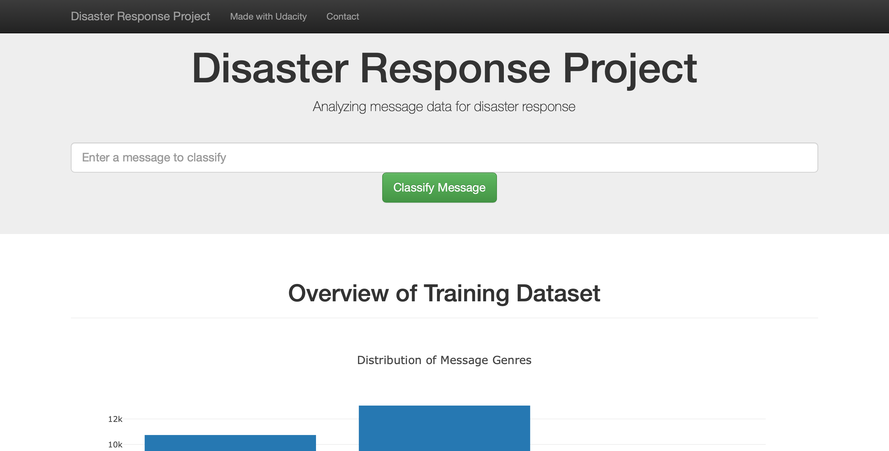
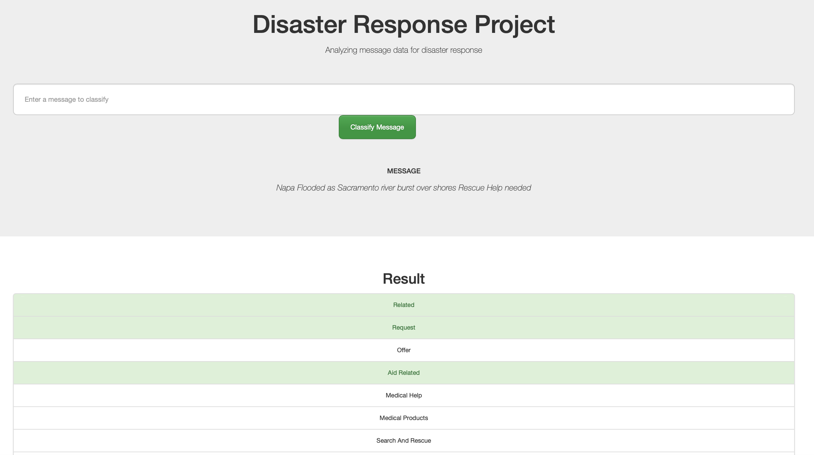
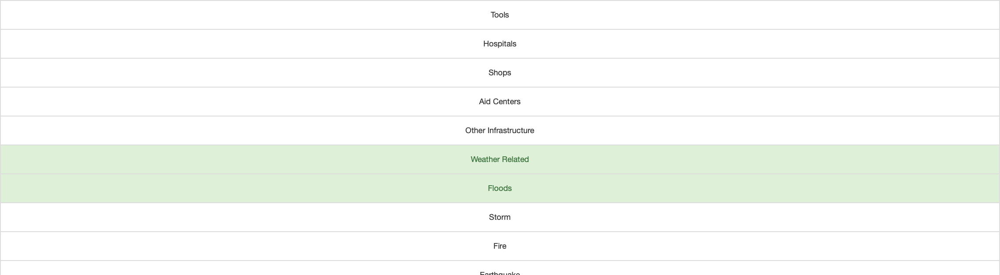
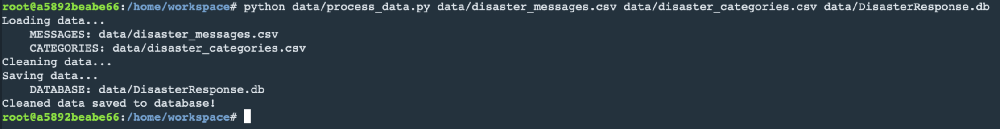
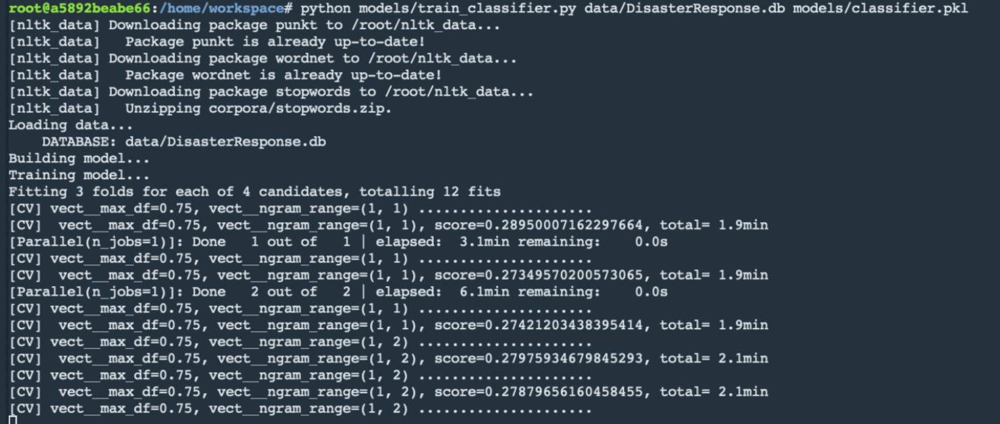
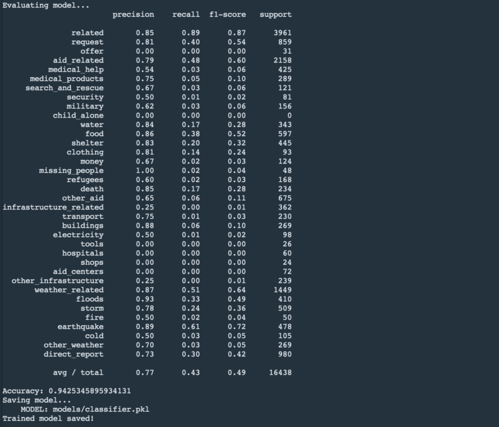
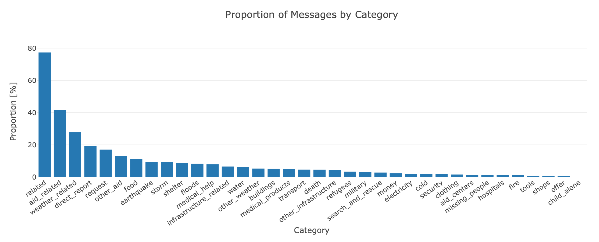

# Project: Disaster Response Pipeline

## Content:

- [Overview](#overview)
- [Project Elements](#elements)
  - [ETL Pipeline](#etl_)
  - [ML Pipeline](#ml_)
  - [Flask App](#flask)
- [Execution](#execute)
  - [Data Cleaning](#cleaning)
  - [Classifier Training](#training)
  - [Web App](#web)
- [Results](#results)
- [Project File Structure](#files)
- [Requirements](#req)
- [Mentions](#mentions)

***

<a id='overview'></a>

## 1.  Overview

In this project disaster response data from <a href="https://www.figure-eight.com/" target="_blank">Figure Eight</a> is analyzed to build a model for Web App that allows for the classification of disaster messages based on 36 different categories.

The aim is to categorize messages received to facilitate the notification to the appropriate disaster relief agencies by emergency personnel.

On the back end the data is processed and modeled.  The front end is a web app that allows an emergency operator to enter a message, which will then be categorized accordingly to allow for the appropriate actions to be taken.

The main dashboard of the app also includes visualizations that summarize the data used as modelling input. 

<a id='elements'></a>

## 2.  Project Components

There are three components of this project:
-  an ETL pipeline
-  a Machine Learning pipeline
-  a flask app

<a id='etl_'></a>

### 2.1  ETL Pipeline

The purpose of the ETL pipeline is:

- Load the {messages} and {categories} datasets
- Merge the datasets
- Clean the data
- Store the data in an **SQLite database**: _data/DisasterResponse.db_

The ETL pipleine can be found in **_data/process_data.py_**

<a id='ml_'></a>

### 2.2  ML Pipeline

The purpose of the ML pipeline is:

- Load data from the **SQLite database**
- Split the data into training and testing sets
- Train and tune a model using GridSearchCV
- Output the results on the test set
- Export the final model to a pickle file

the ML pipeline can be found in **_models/train_classifier.py_**

<a id='flask'></a>

### 2.3  Flask App

The Flask web app's main dashboard provides the main user interface as well as overview visualizations of the dataset.
The main user interface allows emergency operators to enter a meesage they received, i.e. _"Napa flooded as Sacramento River burst over shores. Rescue help needed"_.
The message will be classified and assigned categories out of 36 available. This allows the emrgency operators to take the next steps efficently and effectively.

Here are some screen shots of the web app:

**_Fig. 1  -  Main Dashboard_**



What the app will do is that it will classify the text message into categories so that appropriate relief agency can be reached out for help.

**_Fig. 2 & 3  -  Response page_**




<a id='execute'></a>

## 3. Executing

Three steps need to be taken to get up and running:

- Clean the data
- Run the classifier
- Launch the web app

<a id='cleaning'></a>

### 3.1 Data Cleaning

Requirements:

- path and name of ETL pipeline code file
- path and name of messages dataset file
- path and name of categories dataset file
- path and name of output database file

**Go to the main project directory** and the run the command in this format:

_python path/'ETL pipeline'  path/'messages dataset file'  path/'categories dataset file'  path/'database file'_

this turns into the following command with its 3 arguments:

```bat
python data/process_data.py data/disaster_messages.csv data/disaster_categories.csv data/DisasterResponse.db
```
 
This will run the ETL pipeline and create a database file with the specified name.  If the database file already exists it will be replaced with the new one.

below a screen shot of the process:

_**Fig. 4  -  Processing the Data**_



<a id='training'></a>

### 3.2 Classifier Training

Requirements:

- path and name of ML pipeline code file
- path and name of database file  that was created by the dta processing step
- path and name of of the pickle file where the optimized model will be saved


Run this command **from the main project directory** in this format:

_python path/'ML Piplpeine'  path/'Database File name' path/'name of pickle file'_

this turns into the following command with its 2 arguments:

```bat
python models/train_classifier.py data/DisasterResponse.db models/classifier.pkl
```

This will train the model, improve the model with grid search and save it to a pickle file (_classifer.pkl_).

If the classifier pickle file already exists it will be replaced with the new one.

below a screen shot of the process:

_**Fig. 5 & 6  -  Running the ML Pipeline**_




At the end of the training process the model is evaluated and saved in the pickle file

<a id='web'></a>

### 3.3 Web App

After modeling the data and obtaining a model that has been saved, it is now possible to run the web app, enter messages and have them classified.
To do so from the main project directory we to the **app directory** to run the following command

**Go the app directory** and run the following command:

```bat
python run.py
```

snapshots of the app can be found [here](#flask)

<a id='results'></a>

## 4. Results

Below, there is some information about the training dataset, which can also be seen on the main dashboard of the web app.

**_Fig. 7  -  Samples per category in Data Set_**



The data is highly imbalanced. While accuracy is high (approximately 0.95) the recall measure is quite low (approximately 0.6). This leads to a model that has a hard time detecting the categories, but can be trusted with the ones it predicts. It might be beneficial to get more data to improve model performance. Methods such as undersampling or oversampling could be investigated to balance the dataset.  However these methods do have their own inherent issues that will reduce the accuracy of the final model.

<a id='files'></a>

## 5. Project File Structure

<pre>
.
├── app
│   ├── run.py------------------------# FLASK FILE THAT RUNS APP
│   └── templates
│       ├── go.html-------------------# CLASSIFICATION RESULT PAGE OF WEB APP
│       └── master.html---------------# MAIN PAGE OF WEB APP
├── data
│   ├── DisasterResponse.db-----------# DATABASE TO SAVE CLEANED DATA TO
│   ├── disaster_categories.csv-------# DATA TO PROCESS
│   ├── disaster_messages.csv---------# DATA TO PROCESS
│   └── process_data.py---------------# PERFORMS ETL PROCESS
├── exploration
│   ├── data-pipeline.py--------------# DATA PIPELINE TEMPLATE
│   ├── ETL Pipeline Preparation.ipynb# Jupyter Notebook for ETL Pipeline
│   └── ML Pipeline Preparation.ipynb-# Jupyter Notebook for ML Pipeline
├── media-----------------------------# IMAGES FOR USE IN README
├── models
│   ├── train_classifier.py-----------# PERFORMS CLASSIFICATION TASK
│   └── classifier.pkl----------------# A SAVED MODEL
└──
</pre>

<a id='req'></a>

## 6. Software Requirements

This project uses an Anaconda install with Python 3.6.3 and the following libraries:

- sys
- json
- re
- math
- operator
- pickle
- time
- warnings
- flask==0.12.4
- nltk==3.2.5
- numpy==1.12.1
- pandas==0.23.3
- plotly==2.0.15
- scikit-learn==0.19.1
- sqlalchemy==1.2.18

<a id='mentions'></a>

## 7. Mentions

Thank you to <a href="https://www.udacity.com" target="_blank">Udacity</a> for laying the foundations for this project.

Thank you to <a href="https://www.figure-eight.com/" target="_blank">Figure Eight</a> for providing the datasets for this project
