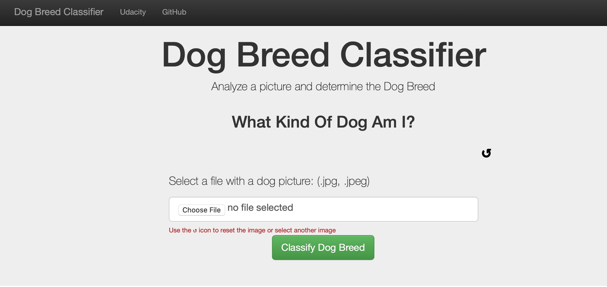
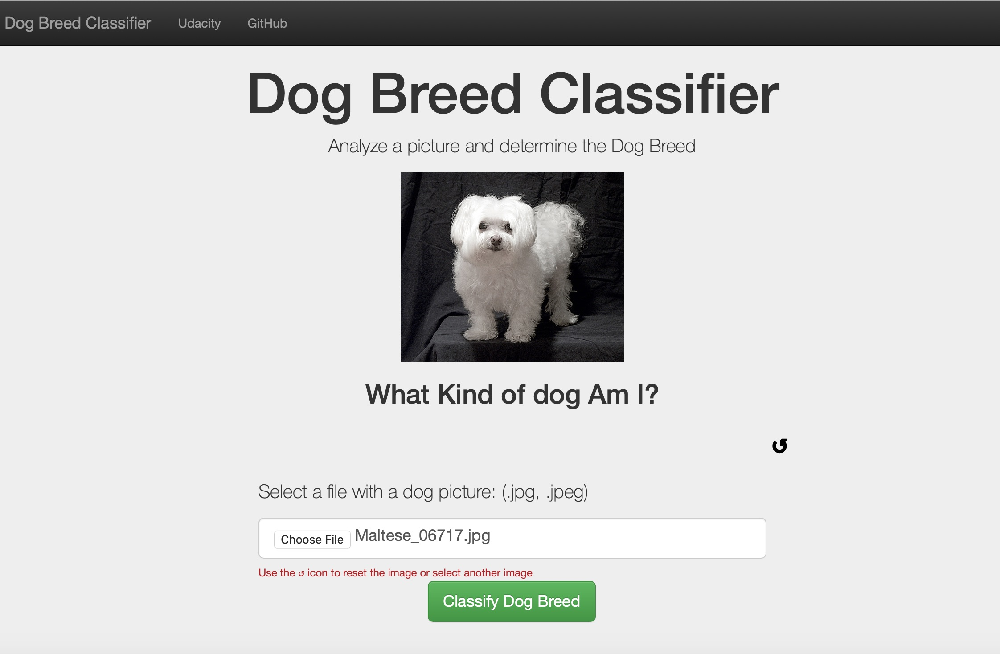
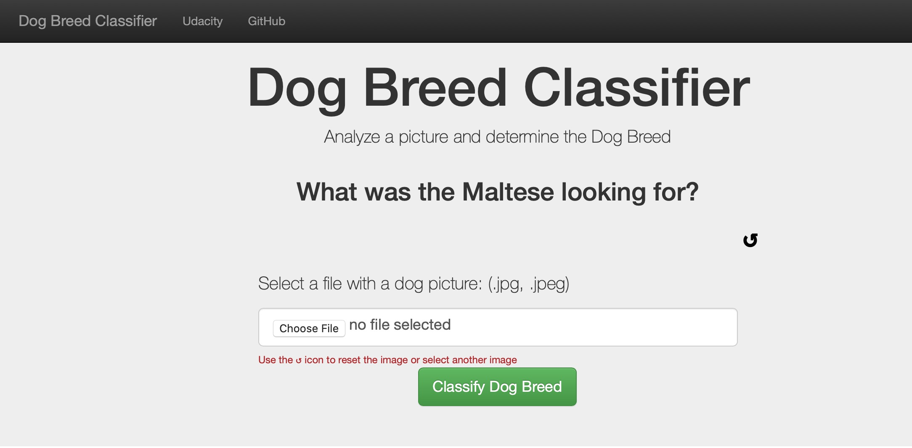

[//]: # (Image References)

[image1]: ./images/command_line_to_run.png "CommandLine"
[image2]: ./images/running_on.png "running_on"
[image3]: ./images/Backend_running.png "backennd_ok"
[image4]: ./images/Sample_App_Screen_Shot.jpg "Loading App"
[image5]: ./images/Sample_App_Screen_Shot_Image_Selected.jpg "Image Selection"
[image6]: ./images/Sample_App_Screen_Shot_Output.jpg "App Output"

## Content:

- [Overview](#overview)
- [Instructions](#instructions)
- [Instructions  -  to run Jupyter Notebook](#inst_ipnoteb)
  - [Optional Steps](#opt)
- [Instructions -  to run web app](#webapp)
- [Project Jupyter Notebook](#open_nb)
- [Requirements](#req)
- [Mentions](#mentions)
- [References](#ref)


<a id='overview'></a>

## Dog Breed Classifier  -  Project Overview

This project provides the user with the ability to predict the breedof a dog from an image selected from their computer.  It consists of 2 part:
1. The derivation of a convolutional neural network to predict the dog breed.  tis portion is using jupyter notebook.
2. A simple web application that allows the user to select an image which is the previewed on the page and upon submitting the image the dog breed will be predicted and displayed on the page. 

The algorithm built will, given an image of a dog, provide an estimate of its breed.  If supplied an image of a human, the code will identify the resembling dog breed. Lastly, If provided an image that it can not classify as dog or human it will provide an output indicating it can not provide an estimate for something not from this world.
 
<p align="center">



</p>

<a id='instructions'></a>

## Project Instructions

### Instructions

1. Clone the repository and navigate to the downloaded folder.
```	
# Create a directory on yur computer, so Git doesn't get messy, and go to it
mkdir my-dir 
cd my-dir

# Start a Git repository
git init

# Track repository, do not enter subdirectory
git remote add -f origin https://github.com/43piRcubed/portfolio

# Enable the tree check feature
git config core.sparseCheckout true

# Create a file in the path: .git/info/sparse-checkout
# That is inside the hidden .git directory that was created
# by running the command: git init
# And inside it enter the name of the sub directory you only want to clone
echo 'dog-project' >> .git/info/sparse-checkout

## Download with pull, not clone
git pull origin master
```

<a id='inst_ipnoteb'></a>

### Instructions  -  to run Jupyter Notebook

2. Download the [dog dataset](https://s3-us-west-1.amazonaws.com/udacity-aind/dog-project/dogImages.zip).  Unzip the folder and place it in the repo, at location `path/to/dog-project/dogImages`.  The direcotry already exists but is empty 

3. Download the [human dataset](https://s3-us-west-1.amazonaws.com/udacity-aind/dog-project/lfw.zip).  Unzip the folder and place it in the repo, at location `path/to/dog-project/lfw`.  If you are using a Windows machine, you are encouraged to use [7zip](http://www.7-zip.org/) to extract the folder. The directory already exists but is empty

4. Donwload Bottleneck Features and place them into the repo, at location `path/to/dog-project/bottleneck_features`.  The directory already exists but is empty.
	1.	[VGG-16 bottleneck features](https://s3-us-west-1.amazonaws.com/udacity-aind/dog-project/DogVGG16Data.npz) for the dog dataset.
	2.	[Resnet50 bottleneck features](https://s3-us-west-1.amazonaws.com/udacity-aind/dog-project/DogResnet50Data.npz) for the dog dataset.
	3.	[Xception bottleneck features](https://s3-us-west-1.amazonaws.com/udacity-aind/dog-project/DogXceptionData.npz) for the dog dataset.

<a id='opt'></a>

5. (Optional) __If you plan to install TensorFlow with GPU support on your local machine__:

    - follow [the guide](https://www.tensorflow.org/install/) to install the necessary NVIDIA software on your system.  
    - If you are using an EC2 GPU instance, you can skip this step.

6. (Optional) **If you are running the project on your local machine (and not using AWS)**, create (and activate) a new environment.

	- __Linux__ (to install with __GPU support__, change `requirements/dog-linux.yml` to `requirements/dog-linux-gpu.yml`): 
	```
	conda env create -f requirements/dog-linux.yml
	source activate dog-project
	```  
	- __Mac__ (to install with __GPU support__, change `requirements/dog-mac.yml` to `requirements/dog-mac-gpu.yml`): 
	```
	conda env create -f requirements/dog-mac.yml
	source activate dog-project
	```  
	- __Windows__ (to install with __GPU support__, change `requirements/dog-windows.yml` to `requirements/dog-windows-gpu.yml`):  
	```
	conda env create -f requirements/dog-windows.yml
	activate dog-project
	```
	
7. (Optional) **If you are running the project on your local machine (and not using AWS)** and Step 6 throws errors, try this __alternative__ step to create your environment.

	- __Linux__ or __Mac__ (to install with __GPU support__, change `requirements/requirements.txt` to `requirements/requirements-gpu.txt`): 
	```
	conda create --name dog-project python=3.6
	source activate dog-project
	pip install -r requirements/requirements.txt
	```  
	- __Windows__ (to install with __GPU support__, change `requirements/requirements.txt` to `requirements/requirements-gpu.txt`):  
	```
	conda create --name dog-project python=3.6
	activate dog-project
	pip install -r requirements/requirements.txt
	```
	
8. (Optional) **If you are using AWS**, install Tensorflow.

 	```
	sudo python3 -m pip install -r requirements/requirements-gpu.txt
	```
	
9. Switch [Keras backend](https://keras.io/backend/) to TensorFlow.

	- __Linux__ or __Mac__: 
	```
	KERAS_BACKEND=tensorflow python -c "from keras import backend"
	```
	- __Windows__: 
	```
	set KERAS_BACKEND=tensorflow
	python -c "from keras import backend"
	```

10. (Optional) **If you are running the project on your local machine (and not using AWS)**:

    - create an [IPython kernel](http://ipython.readthedocs.io/en/stable/install/kernel_install.html) for the `dog-project` environment. 
	```
	python -m ipykernel install --user --name dog-project --display-name "dog-project"
	```

<a id='open_nb'></a>

11. Open the notebook.
```
jupyter notebook dog_app.ipynb
```

12. (Optional) **If you are running the project on your local machine (and not using AWS)**, before running code, change the kernel to match the dog-project environment by using the drop-down menu (**Kernel > Change kernel > dog-project**). Then, follow the instructions in the notebook.

<a id='webapp'></a>

### Instructions  -  to run webapp

13. Navigate to the app directory from the project home direcotry:
	```
	cd app
	```
14. Run the backend:
	```
	python3 dog_breed_run.py
	```
	![CommandLine][image1]

15. Go to your browser ( this was tested with Safari) and type in the below local server ip as indicated once the backend is fully loaded:
	```
	0.0.0.0:3001
	```
	![running_on][image2]
	![backennd_ok][image3]

16. Once the page loads:
	```
	select an image file in the Choose File field (select an image file from your computer)
	click on the Classify Dog Breed Button
	wait until page is loaded again (this may take some time)

	The estimated dog breed wil be displayed

	You can clear the form by either clicking on the top right [Dog Breed Classifier] link 
	or the Round Arrow on the right below the predicted dog breed.
	You can also just select a new image

	current file formats supported are .JPG and .JPEG
	```

<a id='files'></a>

## Project File Structure

<pre>
dog-project	
│
├── [__pycache__]
├── [.ipynb_checkpoints]
├── [app]
│   ├── [__pycache__]
│   ├── [static]
│   │   ├── dog_names.txt-------------------------# contains a list of all the dog breeds
│   │   └── style.css-----------------------------# style sheet for web app
│   ├── dog_breed_run.py--------------------------# Flask file that runs the web app
│   ├── extract_bottleneck_features.py------------# library to extract bottleneck features
│   └── templates
│       └── master.html---------------------------# Main page of web app
├── [bottleneck features]-------------------------# Folder that will contain all the bottleneck features
│	├── 
│   └── 
├── [dogImages]-----------------------------------# Folder that will contain all the dog images
│   ├── 
│   └── 
├── [haarcascades]--------------------------------# Images used in readme
├── [images]--------------------------------------# do not delete contains sample images of dogs as well as images used in readme
│   ├── command_line_to_run.png-------------------# do not delete
│   ├── running_on.png----------------------------# do not delete
│   ├── Backend_running.png-----------------------# do not delete
│   ├── Sample_App_Screen_Shot.jpg----------------# do not delete
│   ├── Sample_App_Screen_Shot_Image_Selected.jpg-# do not delete
│   ├── Sample_App_Screen_Shot_Output.jpg---------# do not delete
│   
├── [lfw]-----------------------------------------# Folder that will contain all human face images 
├── [requirements]
│   ├── requirements.txt--------------------------#
│   ├── requirements-gpu.txt----------------------#
│   ├── dog-mac.yml-------------------------------#
│   ├── dog-mac-gpu.yml---------------------------#
│   ├── dog-linux.yml-----------------------------#
│   ├── dog-linux-gpu.yml-------------------------#
│   ├── dog-windows.yml---------------------------#
│   └── dog-windows-gpu.yml-----------------------#
├── [saved_models]
│   ├── Xception_model.h5-------------------------# do not delete : dog breed prediction model
│   ├── dog_breed_model
│   ├── ResNet50_model.h5
│   ├── weights.best.from_scratch.hdf5------------# saved weights for model in notebook
│   ├── weights.best.VGG16.hdf5-------------------# saved weights for model in notebook
│   └── weights.best.Xc.hdf5----------------------# do not delete : saved weights for Xception in notebook
├── dog_app.ipynb---------------------------------# dog_app notebook
├── dog_app-2.html--------------------------------# dog_app html
├── extract_bottleneck_features.py------------# library to extract bottleneck features
└── README.md
</pre>

<a id='req'></a>

## Requirements

This project uses an __Anaconda__ install with __Python 3.6.3__ and the following libraries:

- flask==1.1.2
- glob2==0.7
- h5py==2.8.0
- ipykernel==5.3.2
- keras==2.0.9
- matplotlib==3.2.2
- numpy==1.17.0
- opencv-python==3.3.1
- pillow==7.2.0
- plotly==2.0.15
- scikit-learn==0.23.1
- scipy==1.5.0
- tensorflow == 1.3.0
- tqdm==4.47.0
- werkzeug==1.0.1

<a id='mentions'></a>

## Mentions

Thank you to <a href="https://www.udacity.com" target="_blank">Udacity</a> for laying the foundations for this project.
Thank you to <a href="https://stackoverflow.com/" target="_blank">Stackoverflow</a> for providing invaluable information and solutions.

<a id='ref'></a>

## References

<a href="https://stackoverflow.com/" target="_blank">Stackoverflow</a>
